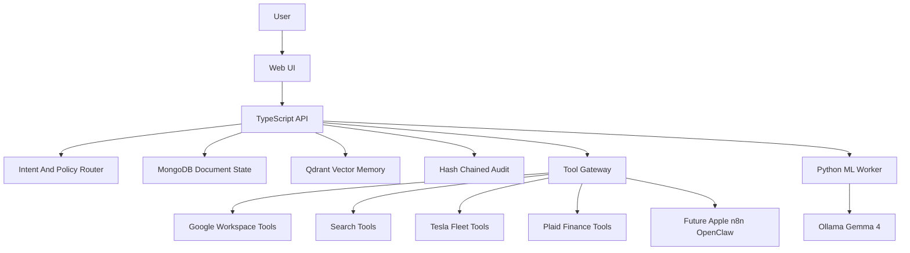

# Architecture

The assistant is split into two runtime boundaries:

- TypeScript control plane: API, state machine, policy, tool routing, OAuth, secrets, approvals, memory, and audit.
- Python ML worker: local model calls, embeddings, and future voice pipelines.

## Request Flow

1. The API receives a chat request and assigns a correlation ID.
2. The deterministic policy router classifies privacy and risk before model execution.
3. If a tool intent is detected, the tool gateway creates a proposal.
4. Read/low-risk tools can execute and notify. Sensitive/high-risk tools create an approval.
5. The API retrieves recent messages and relevant long-term memory.
6. The API sends the user request plus safe tool and memory context to the ML worker.
7. The assistant response, tool decision, memory updates, and model route are persisted and audited.

## Model Routing

All traffic defaults to local Gemma 4 through Ollama. Hosted fallback is reserved for later and should remain disabled for financial, vehicle, Apple Messages, and other sensitive classes unless explicitly approved.

## Memory

The memory layer is split between MongoDB and Qdrant:

- `messages` stores session history.
- `memory_facts` stores subject-predicate-object facts.
- `memory_relationships` keeps a lightweight graph-compatible shape.
- Qdrant stores embeddings for semantic recall when `QDRANT_URL` is configured.

A full graph database can be added later without changing the core memory contracts.
